# BSE411: Biomaterials - Reaction & Structure Visual Guide

This document correlates the lecture transcripts with the specific chemical structures and reaction mechanisms extracted from the lecture slides.

---

## Module 1: Polymer Synthesis (Chain-Growth)

**Theory:** Chain-growth polymerization is a fast "chain reaction." It requires an initiator and proceeds through three distinct stages: Initiation, Propagation, and Termination.

### Stage 1: Decomposition of Initiator
The reaction begins by creating a free radical. Benzoyl peroxide is heated or exposed to UV light, causing the O-O bond to break. This creates two benzoyl free radicals (molecules with an unpaired electron) and releases $CO_2$.

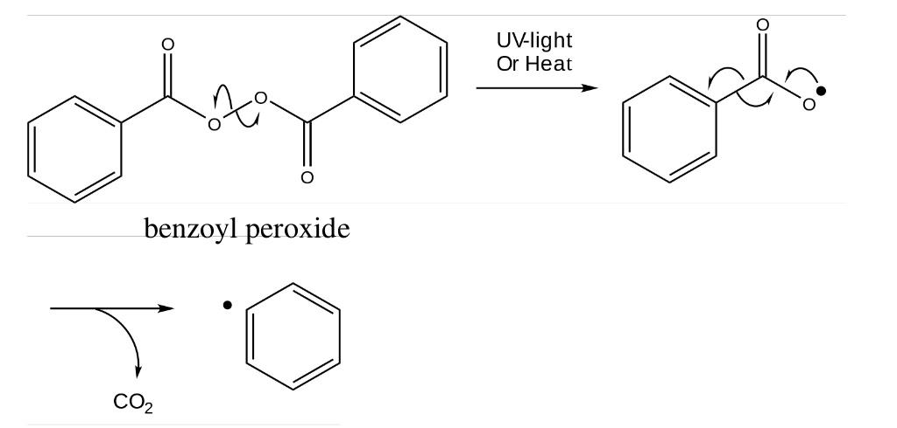

### Stage 2: Initiation & Propagation
**Initiation:** The free radical ($R\cdot$) attacks the double bond of the monomer (Ethyl Acrylate). The radical is transferred to the monomer.
**Propagation:** The "live" chain end attacks another monomer, adding it to the chain. This repeats thousands of times per second.

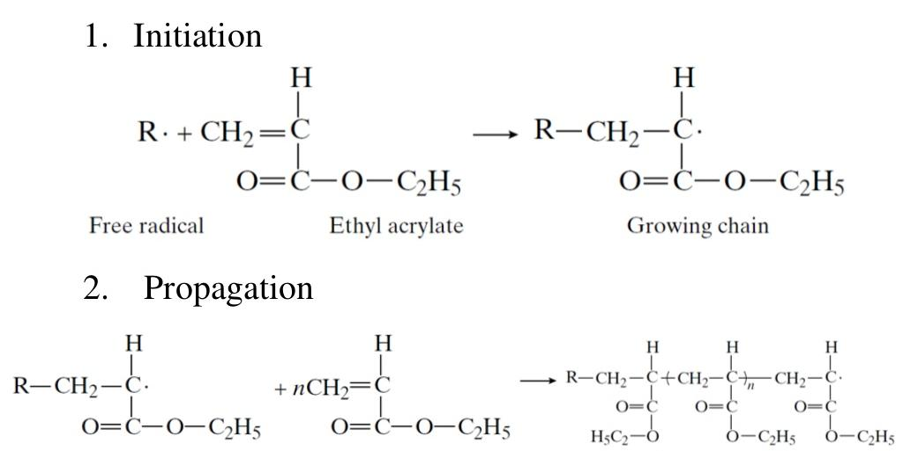

### Stage 3: Termination
The reaction stops when two growing chains (both holding radical ends) collide. They couple together to form a single, dead polymer chain.

### Summary Equation
This general equation shows how the double bond ($C=C$) in Ethylene opens up to form the single bond ($C-C$) backbone of Polyethylene.

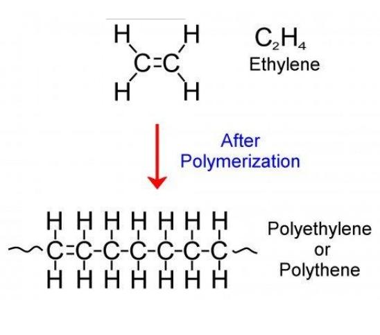

---

## Module 2: Polymer Synthesis (Step-Growth)

**Theory:** Unlike chain-growth, this is a slow, stepwise process. Monomers react to form dimers, then trimers, etc.

### General Mechanism & Polyamides
Top: Monomer A and B form a Dimer.
Bottom: Synthesis of a Polyamide. A Diacid reacts with a Diamine. Water ($H_2O$) is released as a byproduct (Condensation).

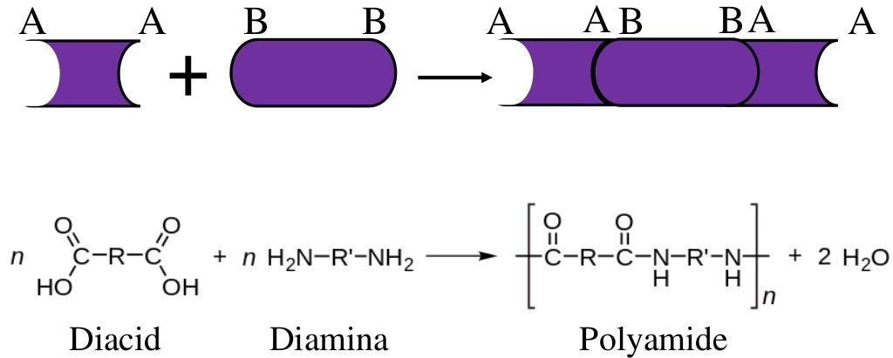

### Specific Example: Nylon 6,6
The synthesis of Nylon 6,6.
**Reactants:** Adipoyl chloride (Diacid derivative) + Hexamethylene diamine.
**Product:** Nylon 6,6 + $HCl$.

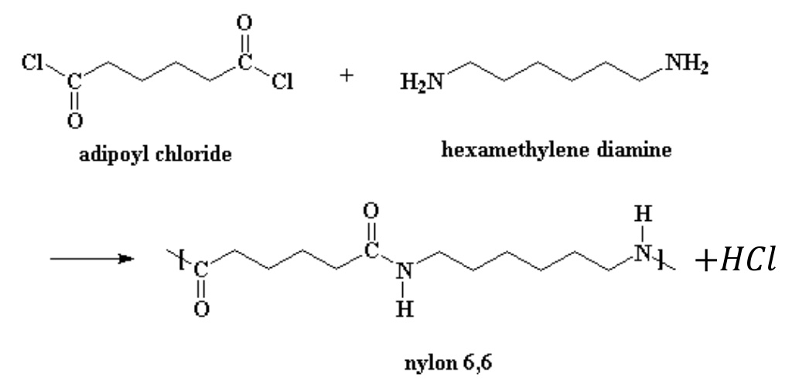

---

## Module 3: Advanced Polymer Synthesis & Structure

### Multistep-Growth (Solid Phase Synthesis)
Used for creating specific sequences (like DNA or Peptides). An initiator is attached to a solid bead support. Monomers with "protective caps" are added one by one, deprotected, and reacted in a cycle.

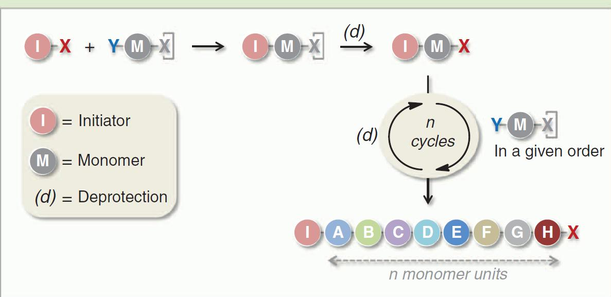

### Polymer Backbones
A dictionary of chemical linkages used to classify polymers (Polyesters, Polyamides, Polyurethanes, Silicones, Epoxies).

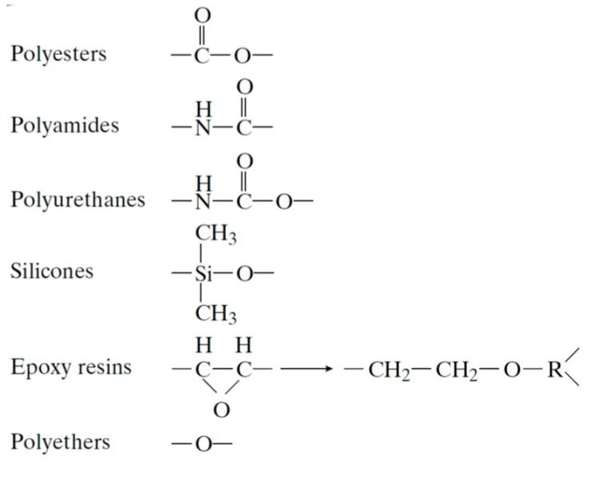

### Common Repeat Units (Commodity Plastics)
Structures for Polyethylene (PE), PVC, Teflon (PTFE), Polypropylene (PP), and Polystyrene (PS).
*Note: Polystyrene has a bulky phenyl ring that restricts rotation, making it stiff.*

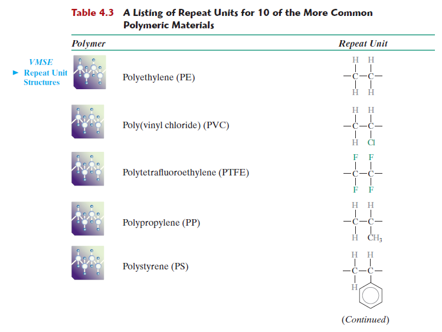

### Common Repeat Units (Engineering & Biomedical)
Structures for PMMA (Bone cement), Bakelite (Network), Nylon, PET (Dacron), and Polycarbonate.

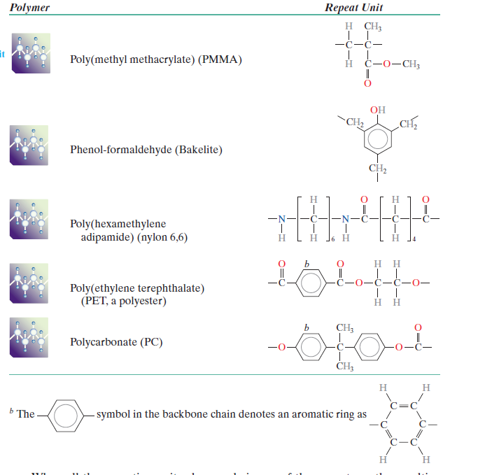

---

## Module 4: Stimuli-Responsive ("Smart") Polymers

### Temperature-Responsive
**Left:** PNIPAM. It exhibits **LCST** behavior. Below 32°C, it dissolves in water. Above 32°C, it collapses and becomes hydrophobic.
**Right:** PVCL, an alternative thermo-responsive polymer.

### pH-Responsive (Synthetic Polyelectrolytes)
**(a) PAA (Polyacrylic acid):** At high pH, COOH groups become $COO^-$. Charges repel, causing swelling.
**(b) PDMAEMA:** Contains amines. Becomes positive ($NH^+$) and swells at low pH.

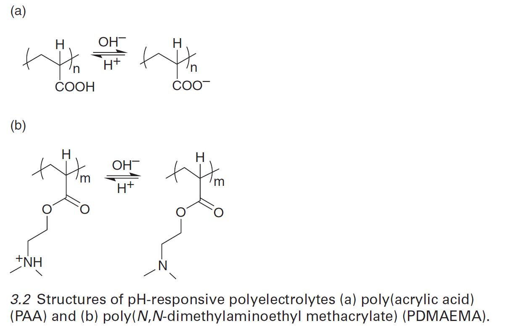

### pH-Responsive (Natural Biopolymers)
**(a) Alginate:** From seaweed ($COOH$ groups).
**(b) Chitosan:** From shells ($NH_2$ groups).
**(c) Hyaluronic Acid:** ECM component.

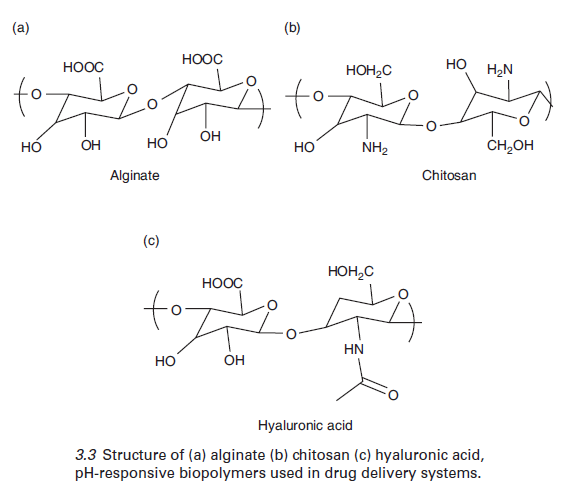

### Zwitterionic Polymers (Stealth Materials)
These polymers contain both a positive and negative charge on the same side chain. This creates a strong hydration shell that prevents protein fouling (an alternative to PEG).

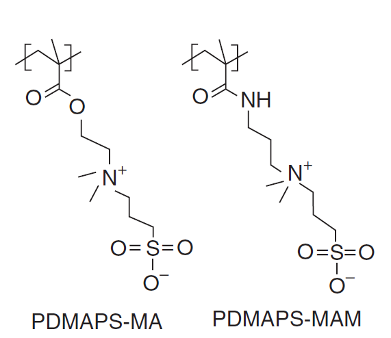

### Photo-Responsive Switches
**Left (Reversible):** Azobenzene. UV light switches it from Trans to Cis; visible light switches it back.
**Right (Irreversible):** o-Nitrobenzyl. Light cleaves the bond completely (photodegradation).

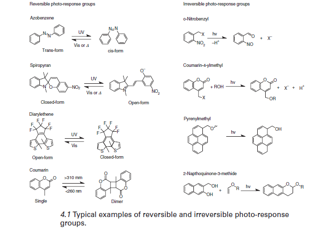

---

## Module 5: Advanced Drug Delivery Architectures

### Colon-Specific Drug Delivery
A "Smart Pill" made of PAA hydrogel crosslinked with azo-bonds.
1. **Stomach (pH 1-3):** Gel is collapsed (protects drug).
2. **Intestine (pH > 4.8):** Gel swells due to charge repulsion.
3. **Colon:** Bacterial enzymes break the azo-bonds, releasing the drug.

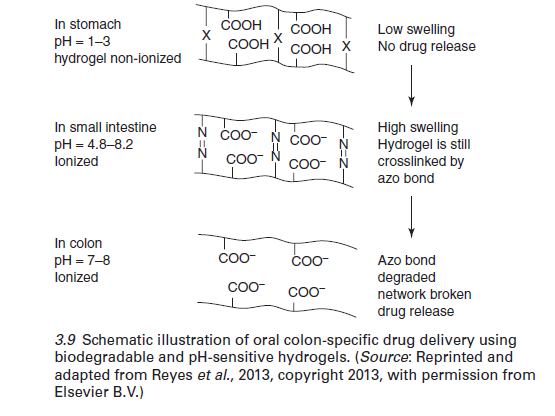

### Conformational Change
Visualizing how a pH change causes a polymer coil to expand or fold into a globule.

### Controlled Radical Polymerization (CRP) Architecture
How we build complex shapes (block copolymers, stars, brushes) using living radical polymerization. (C) shows the insertion of specific monomer blocks in order.

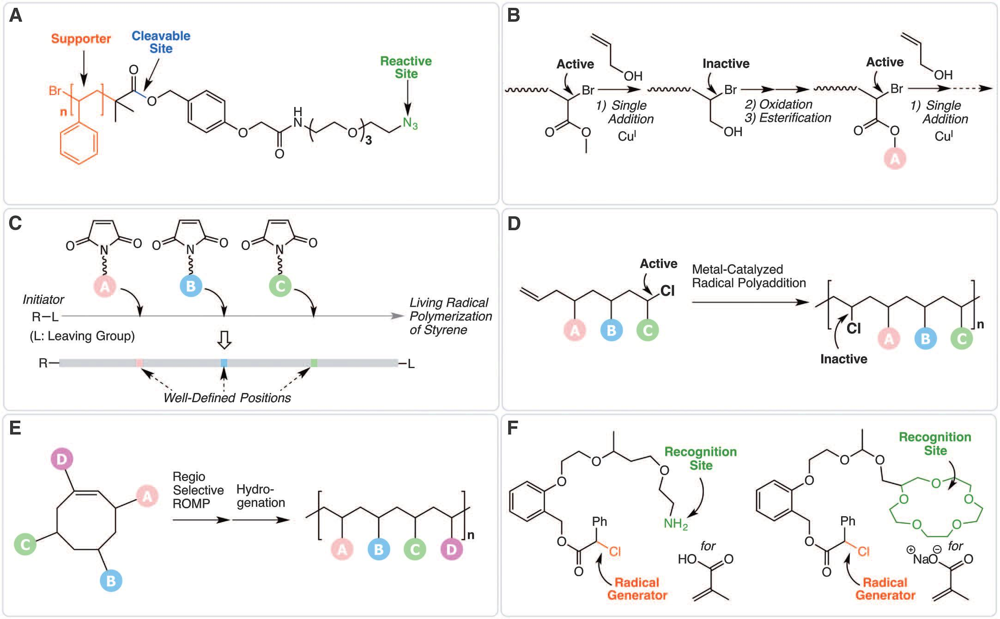

---

## Module 6: Lipids (LNP Building Blocks)

### Neutral & Membrane Lipids
**(a) Glycerolipid:** Standard fat (Triglyceride).
**(b) Glycerophospholipid:** Cell membrane lipid (Polar head + 2 tails).
**(c) Sphingolipid:** Nerve cell lipid.

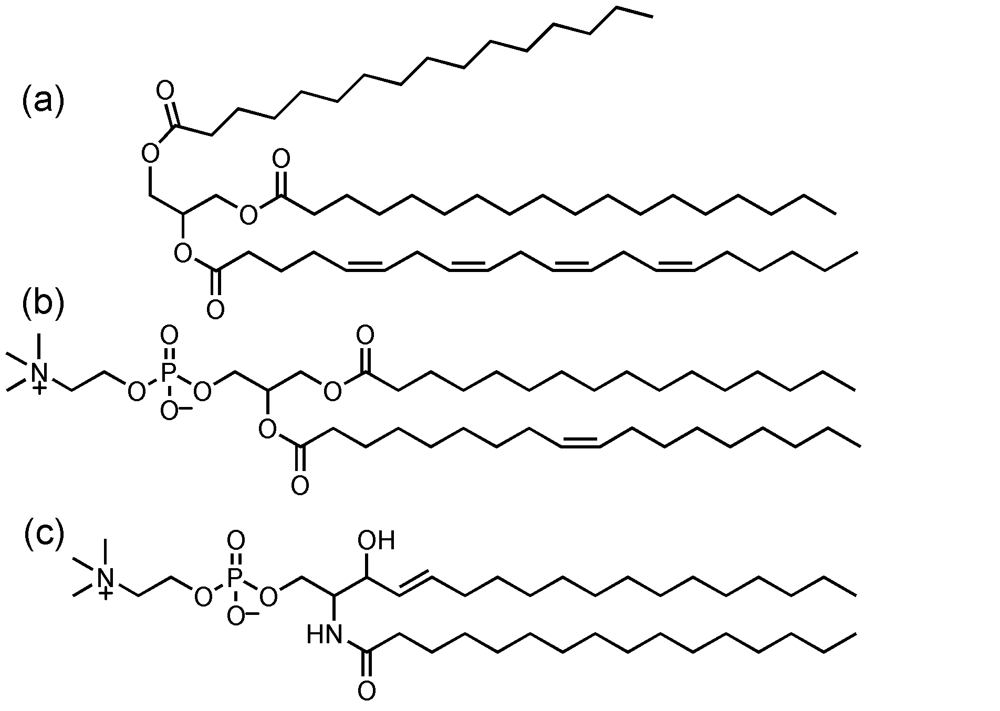

### Lipid Additives & Surfactants
**(d) Cholesterol:** Rigid ring structure used to stiffen membranes.
**(f) Tween 20:** Surfactant/Emulsifier.

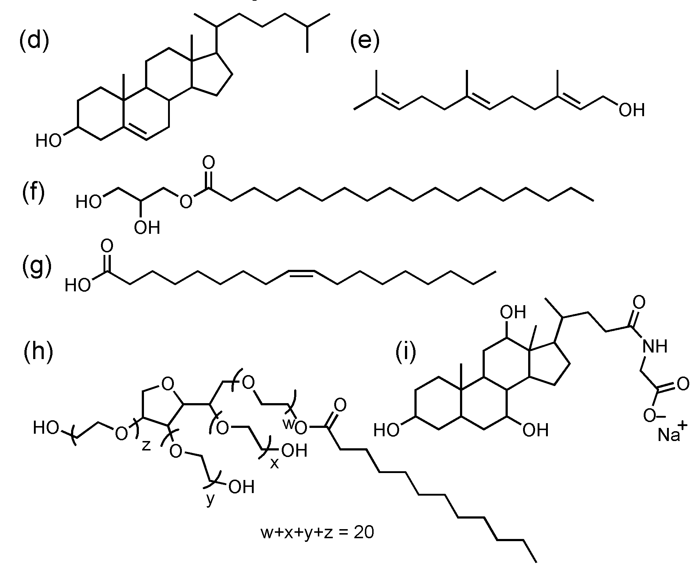

### Cationic Lipids (For Gene Delivery)
Structures like **Chol-DABCO**. They combine a hydrophobic cholesterol tail with a positively charged head group. The positive head binds to negative DNA/RNA to form Lipoplexes.

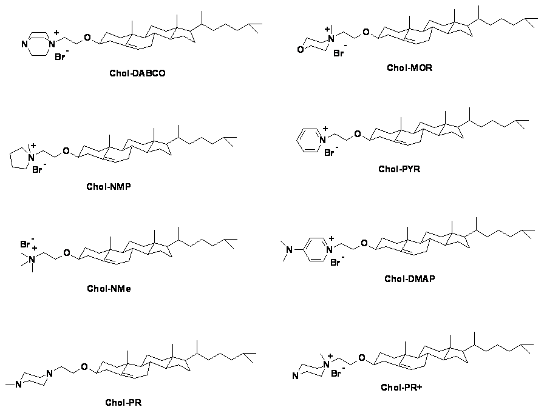

---

## Module 7: Surface Modification

### Specific Chemical Modifications
**(A) Alkylation:** Replacing Chlorine with Methyl (Hydrophobic).
**(B) Anhydride:** Reacting OH with anhydride to add Fluorine (Hydrophobic).
**(C) Hydrosilylation:** Grafting epoxides onto silicone.

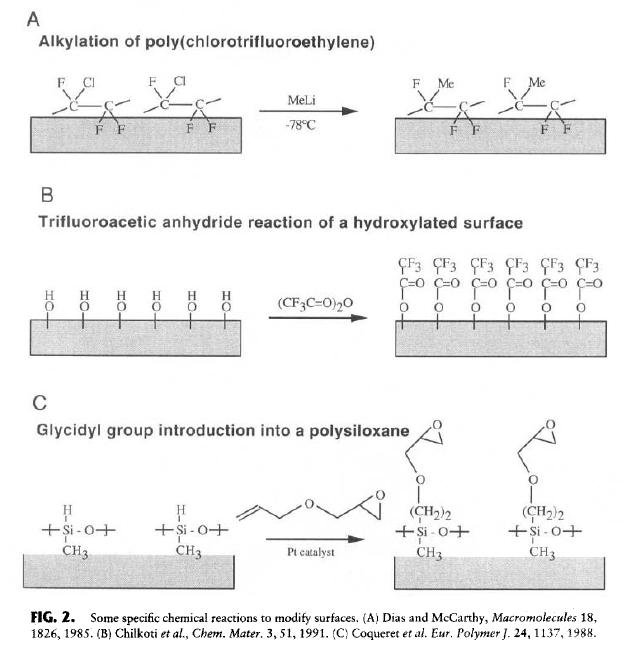

### Silanization Mechanism (The Gold Standard)
**(A-B) Condensation:** Methoxy group on Silane reacts with surface OH. Methanol leaves.
**(C-D) Crosslinking:** Remaining methoxy groups react with neighbors to form a dense 3D network.

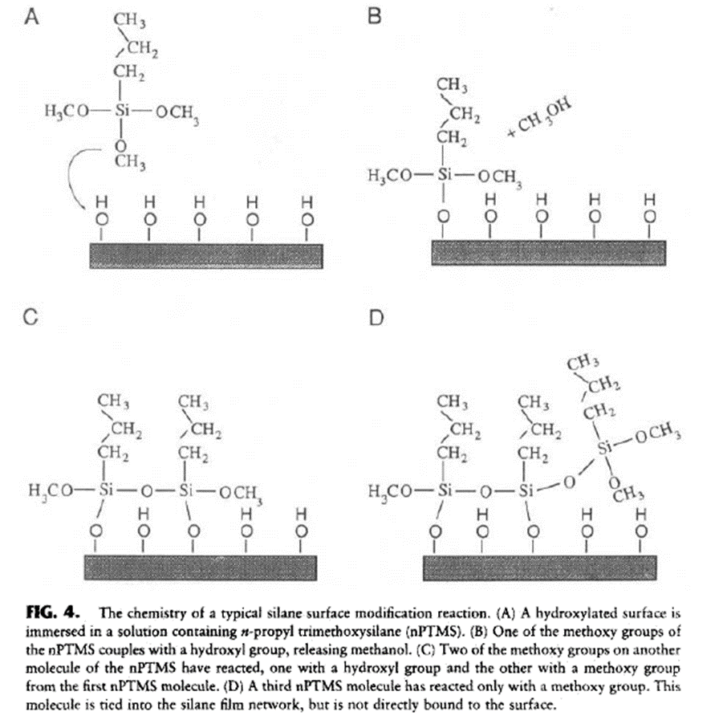

### Types of Silanes
The "Menu" of silanes ($X-Si-R$).
**X (Leaving Group):** Cl or Alkoxy.
**R (Functional Group):** Alkyl (hydrophobic), Amine (bio-active), etc.

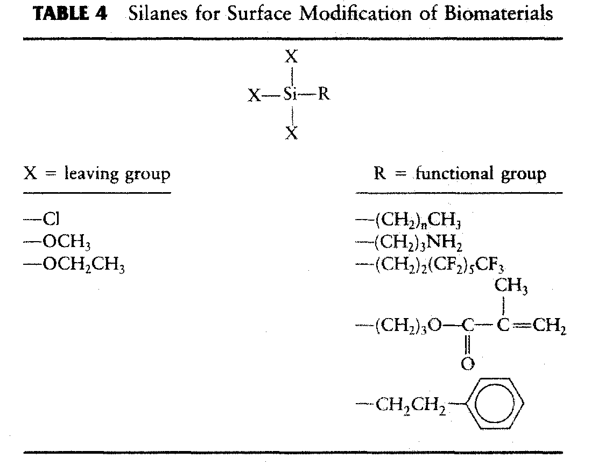

### Covalent Coupling Agents (Protein Immobilization)
**Row 5 (Glutaraldehyde):** A dialdehyde linker. One end binds the surface amine, the other binds the protein amine via Schiff base formation.

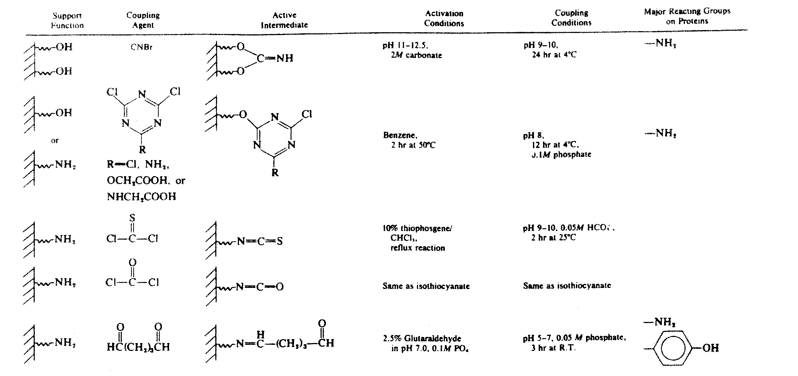

### Parylene Coating (Vapor Deposition)
Used for coating electronics (pacemakers).
1. **Vaporize** the Dimer.
2. **Pyrolize** into Monomers (Radicals).
3. **Deposit** and polymerize on the surface.

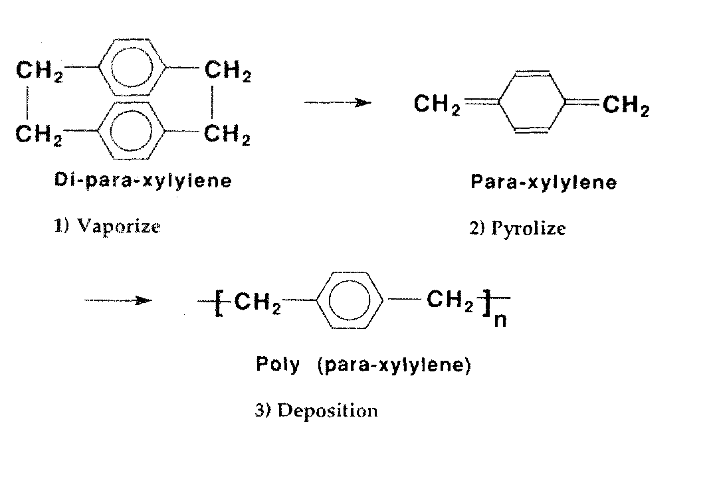

---

## Module 8: Bioceramics & Protein Structure

### Hydroxyapatite (HA) Synthesis
**Hydrothermal Synthesis:** Mixing Calcium Hydroxide + Phosphoric Acid in a heated reactor to precipitate HA.

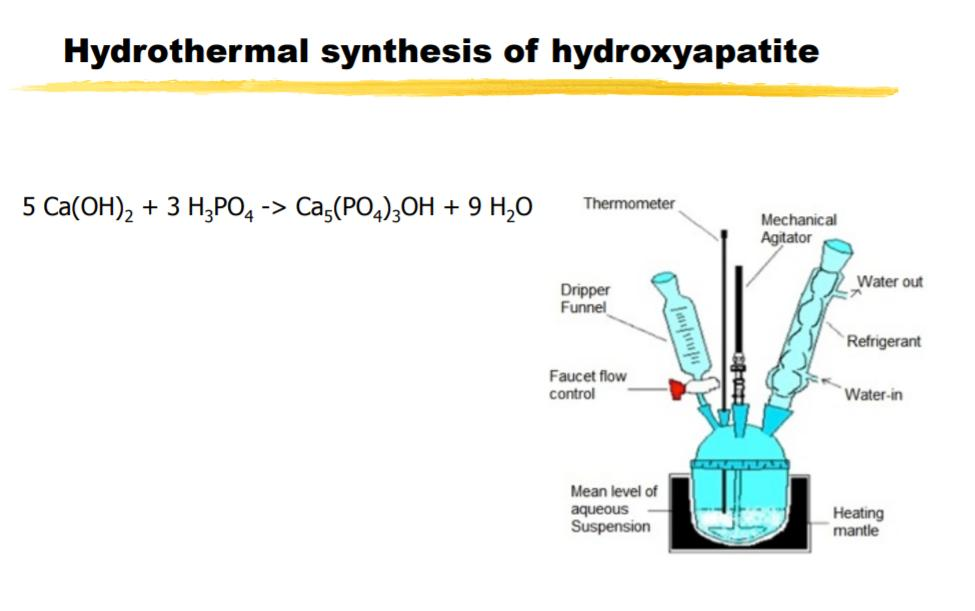

### Hydroxyapatite Structure
The hexagonal crystal lattice of Calcium, Phosphate, and Hydroxyl ions.

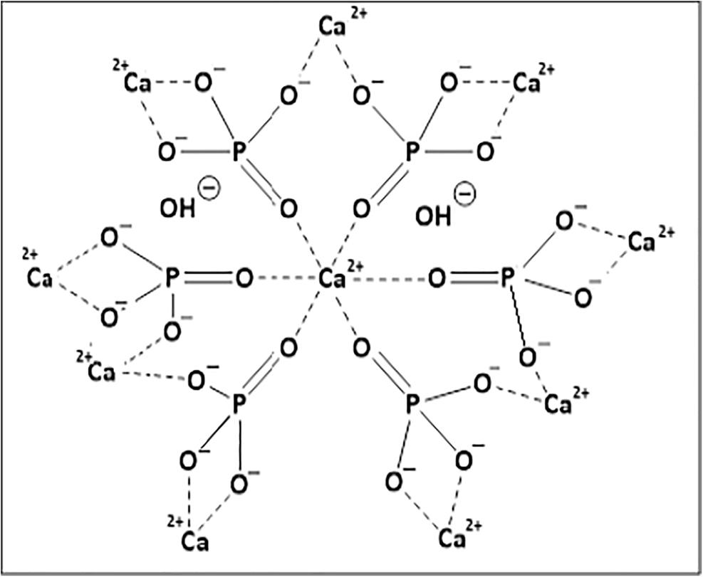

### Amino Acids (Protein Building Blocks)
Side chains determine protein adsorption.
**Cysteine:** Contains Thiol (SH).
**Lysine:** Contains Amine (NH2).
**Aspartic Acid:** Contains Carboxyl (COOH).

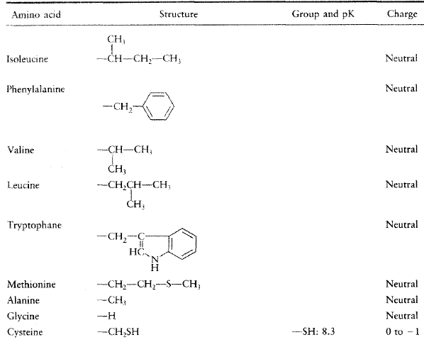

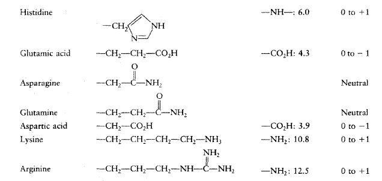
